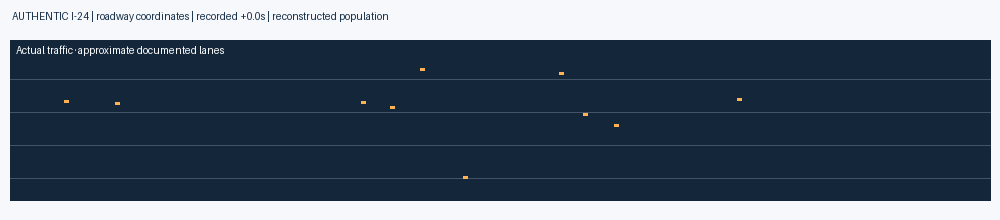
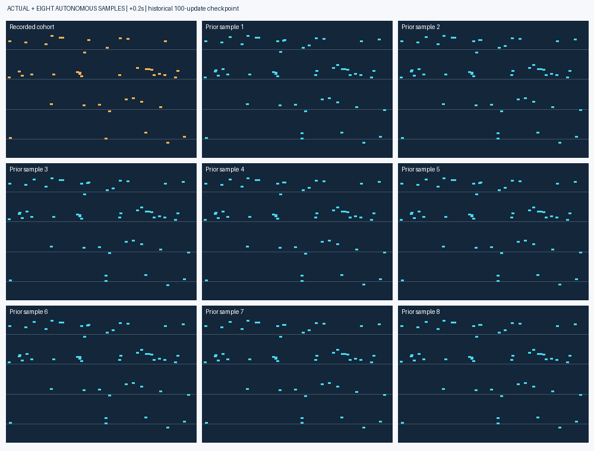
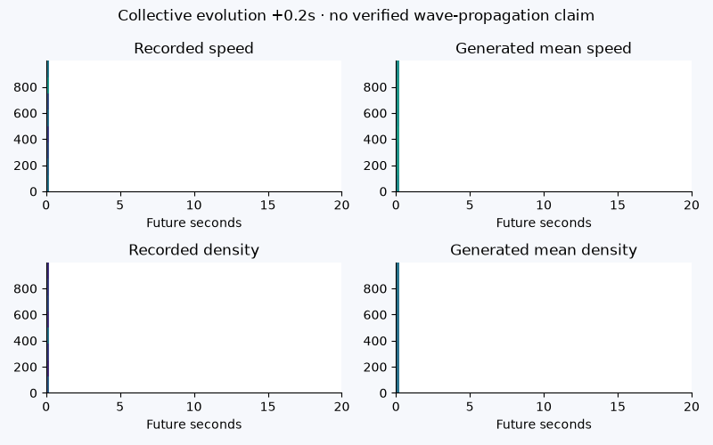
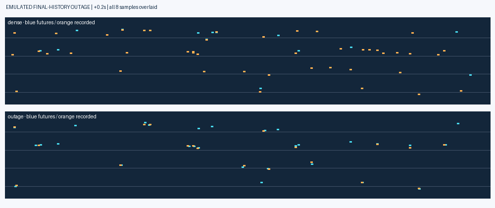
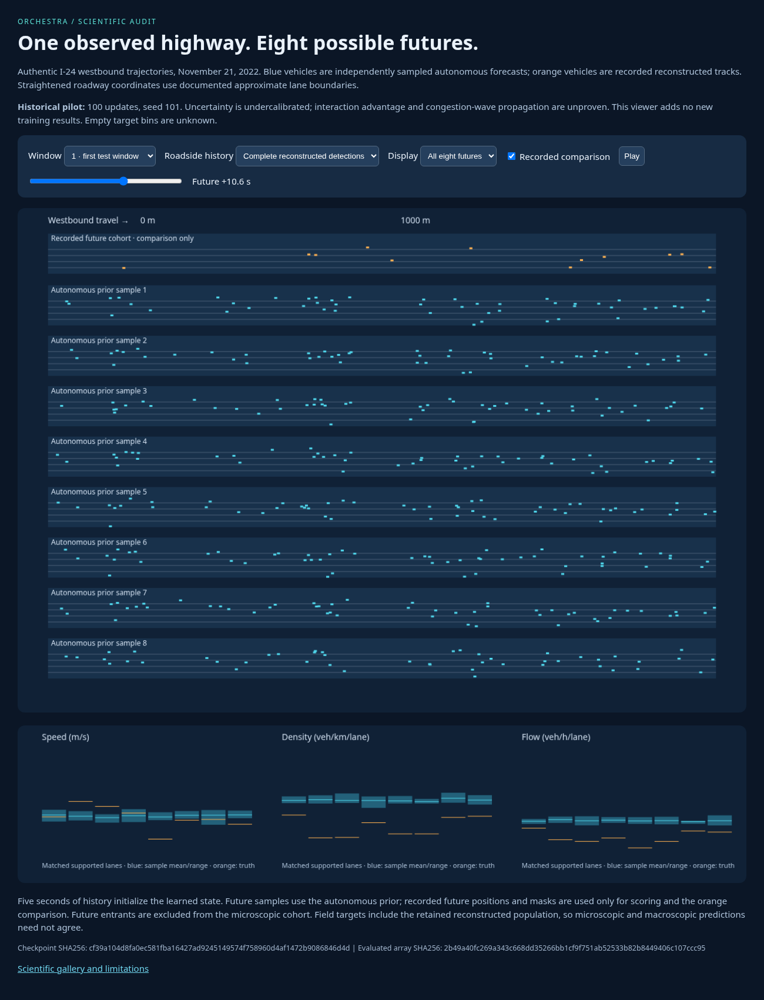
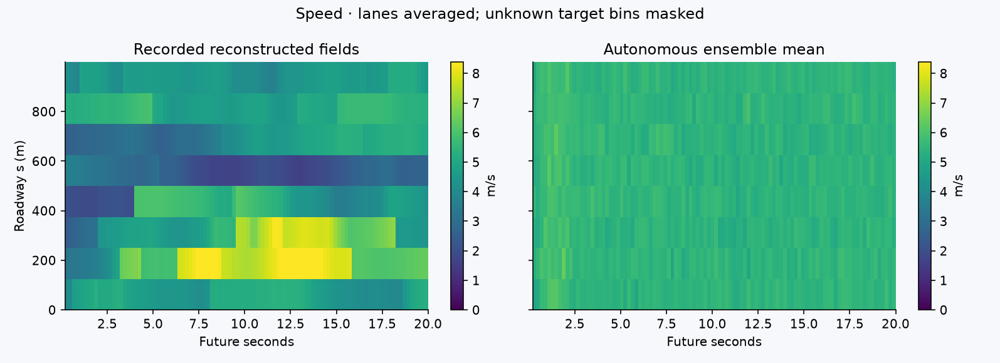
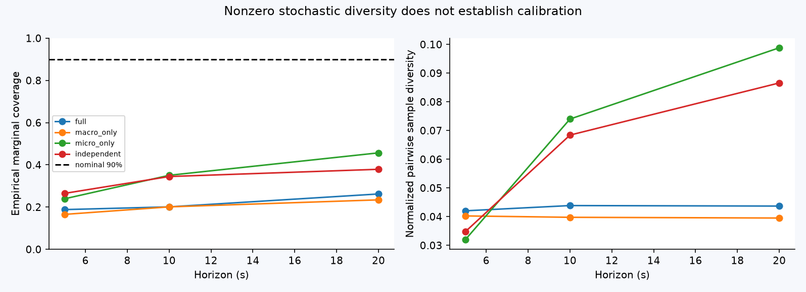

# ORCHESTRA: authentic traffic, eight generated futures

**Phase 4B audit gallery · historical pilot checkpoints · no newly trained model.**

These figures use authentic November 21 recordings and exact saved forecasts from
six preserved 100-update models. The interactive viewer contains all eight full
ORCHESTRA samples for three historical test windows under dense and emulated
outage history. It neither replays recorded futures as predictions nor invents
traffic waves. The original result remains negative and uncertainty is poorly
calibrated. See the [scientific audit](../../../docs/I24_PHASE4B_AUDIT.md).

## Moving traffic

| Authentic reconstructed highway | Actual versus eight independent prior futures |
|---|---|
|  |  |
| 5 Hz causal canonical positions; shown on approximate roadway lanes. | Identical axes and physical times; orange is recorded, blue is generated. |

| Collective fields | Partial observability |
|---|---|
|  |  |
| Recorded versus generated speed/density; unknown support stays masked. No wave-propagation claim. | Same checkpoint with dense or missing final-history detections. Eight samples overlaid; orange recorded comparison. |

## Interactive viewer

[Open/download standalone viewer](index.html). GitHub displays its source: download
and open the HTML in a modern browser to run it locally; no server, token or
network request is needed. No public hosting deployment is claimed.

Select a window, observed/outage history and individual/all eight samples. Scrub
through history and 20 seconds of autonomous futures. Field plots compare the
same supported lane bins and show sample ranges (not calibrated 90% intervals).

[Array and checkpoint provenance](provenance.json) · [Browser validation](validation.json)

## Scientific figures

| Question | Figure |
|---|---|
| What was reconstructed? | [Actual vehicle space-time trajectories](real_trajectories.png) |
| How does speed evolve? | [Recorded/predicted speed kymographs](speed_kymograph.png) |
| What populations and flows are represented? | [Density](density_kymograph.png) · [Flow](flow_kymograph.png) |
| Do macro fields agree with generated vehicles? | [Consistency and known-cohort depletion](micro_macro_consistency.png) |
| How does forecast error grow? | [Horizon and baseline comparison](baseline_horizons.png) |
| Were the original models converged? | [Learning curves](learning_curves.png) |
| Is uncertainty calibrated? | [Coverage and sample diversity](calibration.png) |
| What changes under missing sensing? | [Emulated sensor ablations](missing_sensors.png) |
| What information reaches inference? | [Architecture and information flow](information_flow.png) |

The roadway is a straightened curvilinear representation, not a verified aerial
map. Reconstructed source identities and approximate lanes do not establish
complete roadway census coverage. Future entrants/fragments are absent from the
fixed microscopic cohort. Large differences between blue and orange are actual
model/source-cohort limitations, not a visualization synchronization correction.
All figures are descriptive; three adjacent windows do not supply independent-day
confidence intervals. No new test outcome was used to select a checkpoint.
